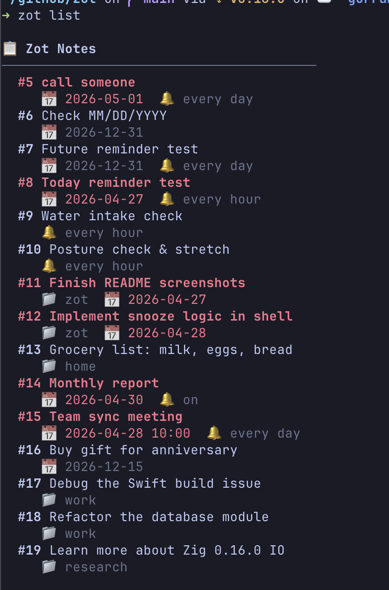
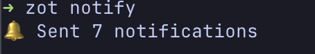
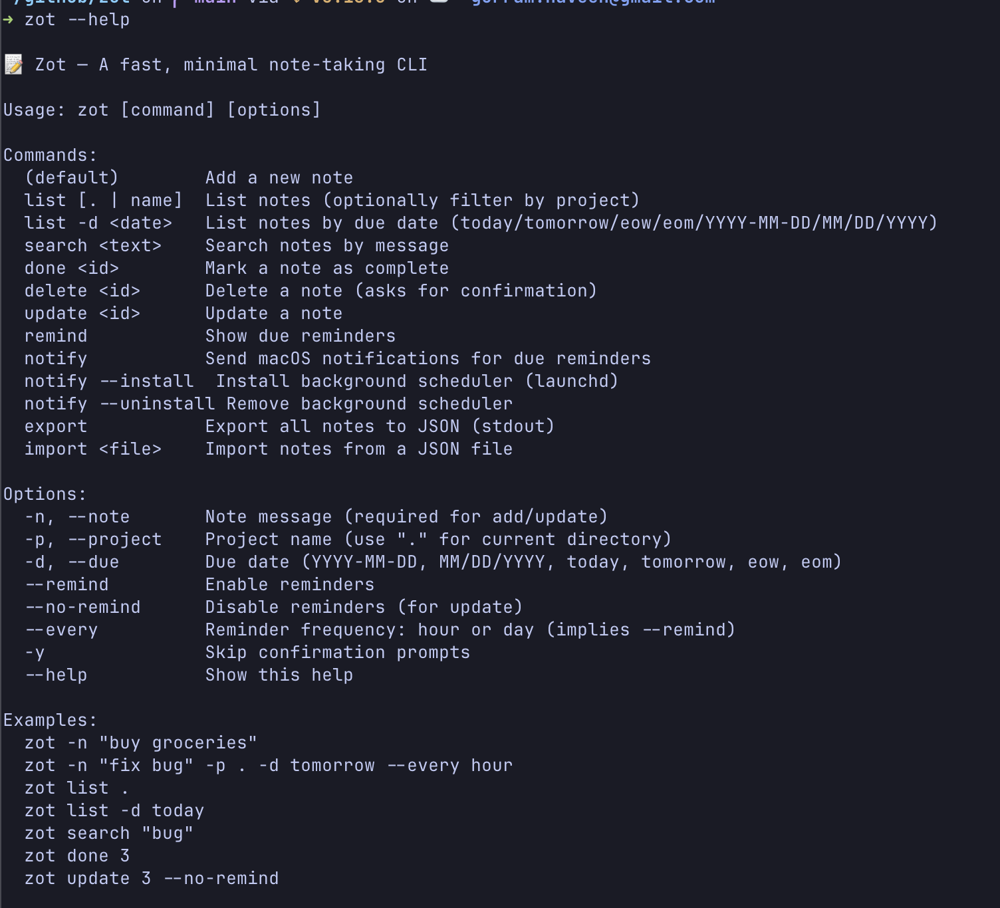
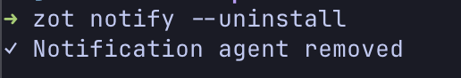
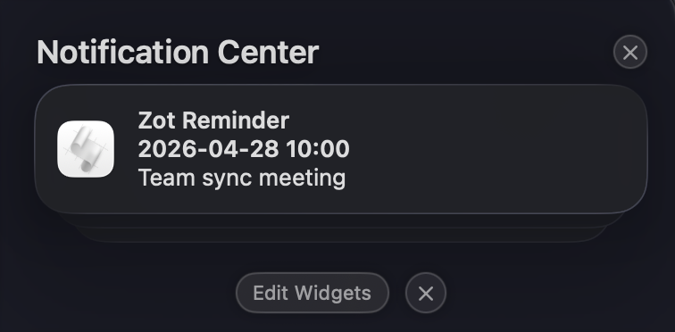
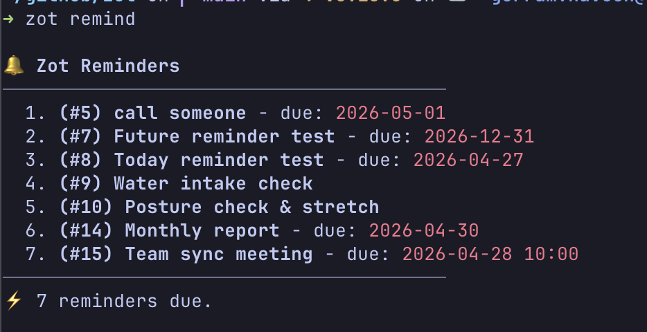

# Zot — A fast, minimal note-taking CLI

[](https://opensource.org/licenses/MIT)

[](#)

<br />

_Named after "jot" (as in jot down ideas) — but since it's written in Zig, it became Zot._

A CLI-first note-taking tool for macOS, built in Zig. No Electron, no browser tabs, no context switching — just capture ideas and get reminded, all from the terminal.

Zot uses macOS system SQLite for zero-dependency storage, fires native macOS notifications via `osascript` for reminders, and exports a C ABI shared library (`libzot.dylib`) for Swift app integration.

## Why

Opening an app to jot down a quick note is friction. Switching windows, waiting for load, clicking through UI — it all adds up. Zot keeps you in the terminal where you're already working. Notes go in fast, reminders come to you as native macOS notifications, and the whole thing compiles to a single binary with no runtime dependencies.

## Screenshots

### 1. List of all notes



### 2. Pushing notifications on demand



### 3. Zot help



### 4. Uninstalling notifications



### 5. MacOs Notification Center



### 6. Showing reminders



## Prerequisites

- **macOS** (notifications use `osascript` and `launchd`)
- **Zig** 0.16.0 or higher
- **SQLite3** (standard on macOS)

## Install

```bash
zig build -Doptimize=ReleaseSafe

# System-wide
sudo cp zig-out/bin/zot /usr/local/bin/

# Or local (add ~/.local/bin to PATH)
mkdir -p ~/.local/bin && cp zig-out/bin/zot ~/.local/bin/
```

## Quick Start

```bash
zot -n "buy groceries"                          # add a note
zot -n "deploy v2" -p myapp -d tomorrow         # with project + due date
zot -n "standup" -d "2026-05-01 09:00" --every hour  # recurring reminder
zot list                                        # see all notes
zot done 3                                      # mark complete
zot notify --install                            # enable macOS notifications
```

## Commands

| Command              | Description                                |
| -------------------- | ------------------------------------------ |
| _(default)_          | Add a new note                             |
| `list [. \| name]`   | List notes (optionally filter by project)  |
| `list -d <date>`     | List notes by due date                     |
| `search <text>`      | Search notes by message (case-insensitive) |
| `done <id>`          | Mark a note as complete                    |
| `delete <id>`        | Delete a note (asks for confirmation)      |
| `update <id>`        | Update a note by ID                        |
| `remind`             | Show due reminders in terminal             |
| `notify`             | Send macOS notifications for due reminders |
| `notify --install`   | Install background notification scheduler  |
| `notify --uninstall` | Remove background notification scheduler   |
| `export`             | Export all notes to JSON (stdout)          |
| `import <file>`      | Import notes from a JSON file              |

## Options

| Flag          | Short | Description                                            |
| ------------- | ----- | ------------------------------------------------------ |
| `--note`      | `-n`  | Note message (required for add/update)                 |
| `--project`   | `-p`  | Project name (use `.` for current directory)           |
| `--due`       | `-d`  | Due date                                               |
| `--remind`    |       | Enable reminders                                       |
| `--no-remind` |       | Disable reminders (for update)                         |
| `--every`     |       | Reminder frequency: `hour` or `day` (implies --remind) |
| `-y`          |       | Skip confirmation prompts                              |
| `--help`      | `-h`  | Show help                                              |

## Due Date Formats

| Format             | Example            | Description                     |
| ------------------ | ------------------ | ------------------------------- |
| `YYYY-MM-DD`       | `2026-05-01`       | ISO date                        |
| `MM/DD/YYYY`       | `05/01/2026`       | US date                         |
| `YYYY-MM-DD HH:MM` | `2026-05-01 14:00` | Date with time (09:00–17:00)    |
| `today`            |                    | Today's date                    |
| `tomorrow`         |                    | Tomorrow's date                 |
| `eow`              |                    | End of week (Friday)            |
| `eom`              |                    | End of month (last working day) |

## macOS Notifications

Zot can send native macOS notifications for due reminders — no UI app needed.

### One-shot

```bash
zot notify
```

Checks all notes with reminders enabled and fires a macOS notification for each one that's due. Useful for testing or running from a cron job.

### Background scheduler (recommended)

```bash
zot notify --install
```

This generates a `launchd` plist at `~/Library/LaunchAgents/com.zot.notify.plist` and loads it. The agent runs `zot notify` every 5 minutes in the background, so you get notifications automatically without keeping a terminal open.

To remove:

```bash
zot notify --uninstall
```

**Note:** macOS may require you to allow notifications from `osascript` in System Settings → Notifications.

### How it works

1. Notes with `--remind` (or `--every hour|day`) are flagged in SQLite
2. `zot notify` queries for due reminders using the same logic as `zot remind`
3. Each due reminder fires a native macOS notification via `osascript -e 'display notification ...'`
4. The launchd agent runs this check every 5 minutes, persisting across reboots

## Examples

```bash
# Notes
zot -n "buy groceries"
zot -n "fix auth bug" -p . -d tomorrow
zot -n "pay rent" -d 05/01/2026

# Reminders
zot -n "standup" -d "2026-05-01 09:00" --every hour
zot -n "weekly review" -d eow --every day
zot remind                    # check in terminal
zot notify                    # fire macOS notifications

# Management
zot list .                    # notes for current project
zot list -d today             # notes due today
zot search "bug"
zot done 3
zot update 3 -n "new text" --no-remind

# Export / Import
zot export > backup.json
zot import backup.json
```

## Swift Integration (C ABI)

Zot builds a shared library (`libzot.dylib`) with C-exported functions, designed for embedding in macOS Swift apps. The C ABI means no Zig runtime dependency — any language that can call C can use it.

### Header (`include/zot.h`)

```c
bool zot_init(void);
void zot_deinit(void);
int64_t zot_add(const char *message, const char *project, const char *due_date, bool remind, uint8_t schedule);
bool zot_delete(int64_t id);
bool zot_update(int64_t id, const char *message, const char *project, const char *due_date, bool remind, uint8_t schedule);
void zot_list(zot_list_callback cb);
bool zot_done(int64_t id);
void zot_search(const char *keyword, zot_list_callback cb);
void zot_list_by_due(const char *due_date, zot_list_callback cb);
```

## Architecture

```
┌─────────────┐     ┌──────────────┐     ┌─────────────┐
│   CLI        │────▶│   db.zig     │────▶│   SQLite    │
│  main.zig    │     │  (storage)   │     │  ~/.zot_    │
│  notify.zig  │     └──────────────┘     │  notes.db   │
└─────────────┘            ▲              └─────────────┘
                           │
┌─────────────┐            │
│  lib.zig    │────────────┘
│  (C ABI)    │
│  libzot.dylib
└─────────────┘
       ▲
       │
┌─────────────┐
│  Swift App  │  (future / community)
└─────────────┘
```

- **main.zig** — CLI entry point, argument parsing, terminal output
- **notify.zig** — macOS notification delivery via `osascript`, launchd plist management
- **db.zig** — SQLite storage, queries, date resolution, validation
- **lib.zig** — C ABI exports for `libzot.dylib` (Swift/native app integration)
- **tests.zig** — Unit tests for storage, validation, and date logic

## Design Decisions

- **Zig over Rust/Go** — Zero-overhead C interop without a runtime. The C ABI library is a natural byproduct, not a wrapper. No garbage collector, no async runtime, just direct syscalls and SQLite.
- **SQLite over flat files** — ACID transactions, indexed queries, and the database is a single file. macOS ships SQLite, so there's no dependency to install.
- **osascript over UserNotifications** — No app bundle required, no entitlements, no code signing. Works from a plain CLI binary. The tradeoff is less control over notification actions, but for reminders that's fine.
- **launchd over cron** — Native macOS process management. Survives reboots, respects user sessions, and integrates with `launchctl` for easy install/uninstall.

## Notes & Limitations

- **Database**: SQLite data stored at `~/.zot_notes.db`
- **Text Size**: Messages can be up to ~1GB in SQLite; CLI input limited by OS (~256KB)
- **Notifications**: Requires macOS. The `osascript` approach may need notification permissions in System Settings.
- **JSON Format**: Exported JSON includes all fields: `id`, `message`, `project`, `due_date`, `remind`, `schedule`, `done`

## Running Tests

```bash
zig build test
```

## Project Structure

```
├── build.zig                # Build config (exe + dylib + tests)
├── include/zot.h            # C header for Swift bridging
└── src/
    ├── db.zig               # SQLite storage & query logic
    ├── lib.zig              # C ABI shared library exports
    ├── main.zig             # CLI entry point
    ├── notify.zig           # macOS notifications & launchd integration
    └── tests.zig            # Unit tests
```

## License

MIT
